# Tracking an index with 10 large-cap stocks

## Data
- Dependent Variable(y): Return of Composite index
- Explanatory Variables(X): Returns of 10 large-cap stocks
- We don't know whether the data represents a national index or a company stock; we have to rely solely on the data to build our model.

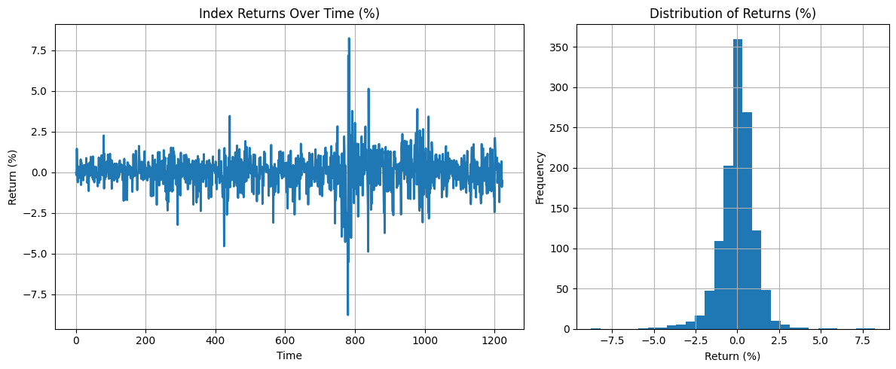

## Table of Contents

1. Identifying Non-Gaussian Periods
2. Extracting Latent Factors via PCA
3. Model Performance Comparison

## 1. Identifying Non-Gaussian Periods

### 1-1. Is OLS the Best Model for This Situation?

In general market conditions, stock returns are known to follow a normal distribution. If that’s the case, is building a tracking model using Ordinary Least Squares (OLS) all we need?

$$
y = X\beta + \epsilon
$$

If the data follows a normal distribution, then OLS is the optimal method. This is because, under the assumption of normality, OLS is equivalent to the Maximum Likelihood Estimator (MLE), and MLE is known to be the Best Unbiased Estimator (BUE).

Being a BUE means that OLS is not just the best among linear models—it is the most efficient estimator even when compared to nonlinear models. In other words, no machine learning or deep learning model can outperform OLS under these conditions; at best, they can only match its performance.

However, in financial markets, stock returns often deviate from a normal distribution during specific events such as the COVID-19 pandemic or economic crises. In such cases, non-linear fitting methods—including machine learning and deep learning models—can become meaningful alternatives.

Let’s explore these non-Gaussian periods and dive deeper into the underlying structure of the data.

### 1-2. Sub-interval

The dataset we have consists of three segments: first, full, and last. The full segment represents the entire time period, while first and last correspond to the early and late portions of the full period, respectively. Let’s examine whether each of these segments follows a Gaussian distribution.

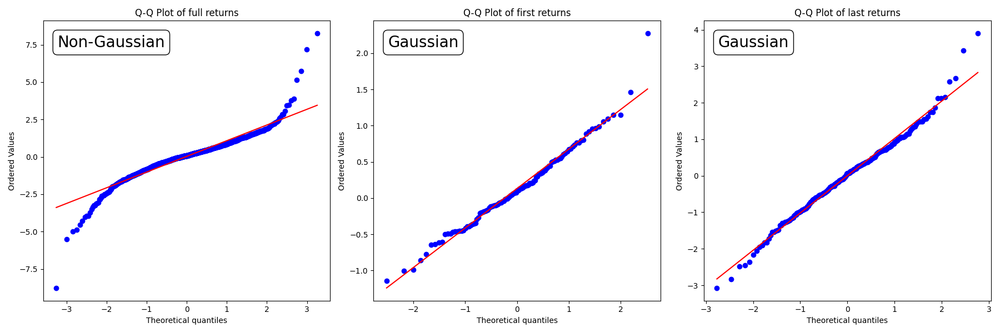

Based on the Q-Q plots and results from the Kolmogorov–Smirnov test(K-S test), the full segment appears to be non-Gaussian, whereas the first and last segments follow a Gaussian distribution. This suggests that, with appropriate sub-intervals, it is possible to identify periods where the data follows Non-Gaussian.

Therefore, I divided the data into sub-intervals—monthly, quarterly, semiannually, and annually—and performed normality tests on each segment to identify periods that deviate from a Gaussian distribution.

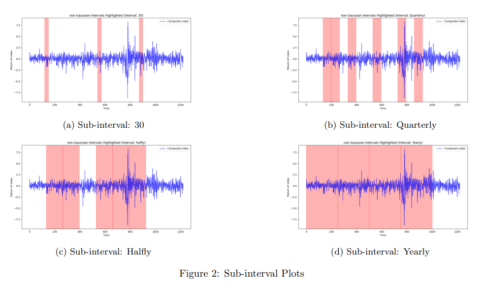

The figure below shows the results of normality tests conducted on sub-intervals of the data split into 30-day, quarterly, semiannual, and annual periods. The red-highlighted segments indicate periods that do not follow a normal distribution.

- Interpretation of Results
  - The results suggest that whether the data appears to follow a Gaussian distribution depends heavily on how the interval length is chosen.
  - This issue arises because the method relies solely on statistical tests, without incorporating any domain knowledge about stock price behavior.
  - Statistical tests can tell us about correlations, but they do not reveal causal relationships.
  - Therefore, unless we have a strong reason to choose a specific interval length, this approach is unstable and not recommended.

### 1-3. GMM

Another approach is to use the Gaussian Mixture Model (GMM). We can assume that the composite index consists of two underlying distributions: one that represents a normal market condition (Gaussian), and another that reflects abnormal conditions such as economic crises, which deviate from normality. This idea can be expressed mathematically as follows:

$$
y = w_1 D_1 + w_2 D_2
$$

- $y:$ Composite Index
- $D_1$: a Gaussian distribution representing normal market conditions
- $D_2$: a distribution representing abnormal market conditions
- The weights $w_1$ and $w_2$ will vary depending on the state of the market. 

If the composite index follows this kind of structure, we can expect that the Gaussian Mixture Model (GMM) will be effective in distinguishing between distributions associated with normal and abnormal market regimes.

  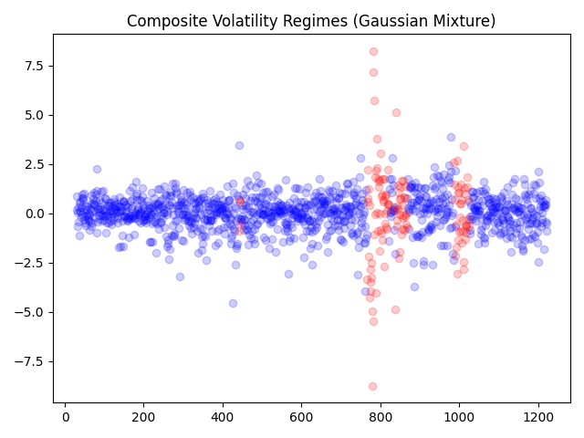

- Interpretation of Results
  - Using GMM, we observe that the data distribution separates more clearly in periods with high variance.
  - This aligns with the common understanding that economic crises are accompanied by "excess volatility".
  - GMM itself only separates the distributions; it is up to the analyst to interpret which distribution corresponds to which market condition.
  - In this case, the blue segments appear to represent the normal distribution, while the red segments likely indicate abnormal market behavior.

## 1-4. GARCH

Let’s further discuss the excess volatility mentioned earlier. When an economic crisis occurs, excess volatility tends to emerge—and this volatility often moves together across time, a phenomenon known as volatility clustering. One model that can effectively capture this behavior is the Generalized AutoRegressive Conditional Heteroskedasticity (GARCH) model.

$$
\sigma_t^2 = \omega + \alpha \epsilon_{t-1}^2 + \beta \sigma_{t-1}^2
$$

  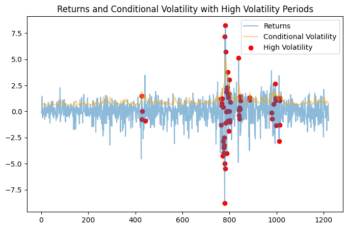

- Interpretation of Results
  - The GARCH model successfully identified periods of high volatility.
  - Similar to GMM, it effectively captured segments where the data deviates from a normal distribution.

## 2. Extracting Latent Factors via PCA

Earlier, we identified the periods during which the composite index follows a normal distribution and those in which it does not. The next step is to consider what factors influence the movement of the composite index.

1. Market Factor
The overall market trend is likely the most significant driver of the composite index. When the market performs well, the index rises; when the market declines, the index tends to fall as well.

2. Industry Factor
Each industry—such as finance, construction, or IT—may have varying degrees of influence on the composite index.

3. Individual Stock Factor
Although the impact of individual stocks may be limited, it is still reasonable to assume that they have some influence on the index.

These factors can be uncovered using methods such as Principal Component Analysis (PCA) or Factor Analysis (FA), both of which are commonly used to extract latent variables. In this analysis, we will focus on using PCA to identify such latent factors.

### 2-1. Comparing Stock Correlations in Gaussian vs. Non-Gaussian Periods

Before conducting PCA, there’s one more important aspect to consider. As seen from the distinction between Gaussian and non-Gaussian periods, stock return behavior is heavily influenced by market conditions. Up to this point, we’ve mainly focused on Y (the composite index), but now we turn our attention to X (the individual stocks).

- During Non-Gaussian Periods
  - Individual stocks tend to fall together, showing high comovement.
  - As a result, we expect stronger correlations among the variables, and PCA will likely reveal that PC1 (interpreted as a market factor) explains a large portion of the variance.

- During Gaussian Periods
  - While the market still has the greatest influence, industry-specific and stock-specific factors may also play meaningful roles.
  - Correlations between variables are expected to be lower—especially among stocks from different sectors.

Before applying PCA, there’s one more important aspect to consider. As we observed earlier when distinguishing between Gaussian and non-Gaussian periods, stock return behavior is strongly influenced by overall market conditions. Until now, we have mainly focused on Y (the composite index), but now we shift our attention to X—the individual stocks.

- Expected behavior during Non-Gaussian periods
  - In times of crisis, individual stocks tend to fall simultaneously, leading to higher correlations among variables.
  - As a result, when PCA is performed, we can expect PC1—interpreted as the market factor—to explain most of the variance.

- Expected behavior during Gaussian periods
  - Even in normal times, the market factor has the greatest influence, but industry-specific and stock-specific factors are also likely to play a role.
  - Correlations among variables are expected to be relatively low, especially for stocks that belong to different sectors.

  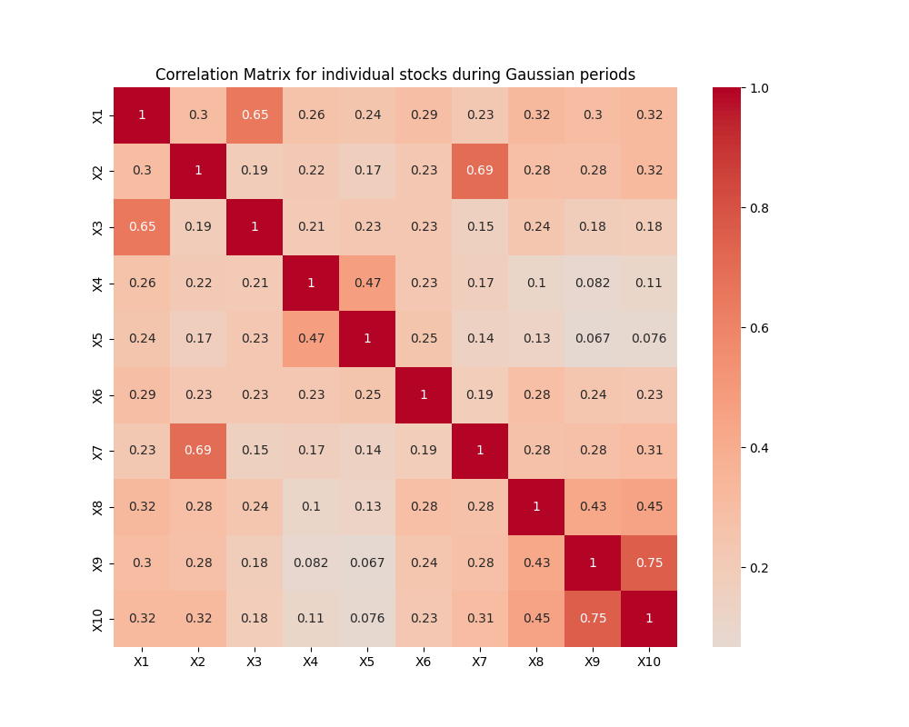
  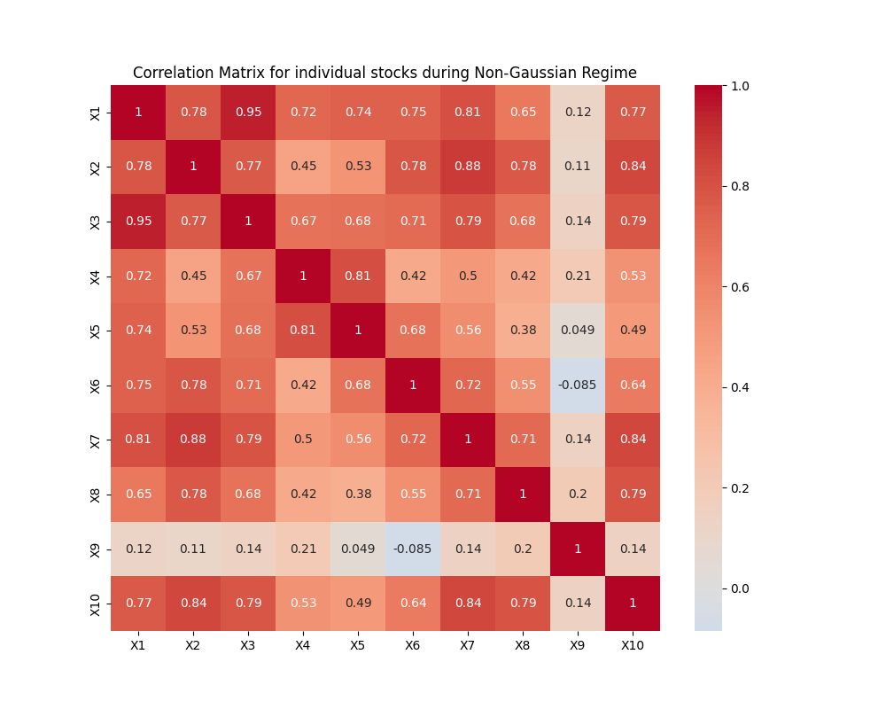

- Interpretation of Results (left: Gaussian, right: Non-Gaussian)
  - As expected, during Gaussian periods, the correlations among individual stocks are relatively low.
  - In contrast, during Non-Gaussian periods, the correlations among stocks increase significantly.

Next, let's perform PCA separately on the Gaussian and non-Gaussian periods to compare how the influence of each variable differs between the two.

### 2-2. Comparing Variable Influence in Gaussian vs. Non-Gaussian Periods Using PCA

  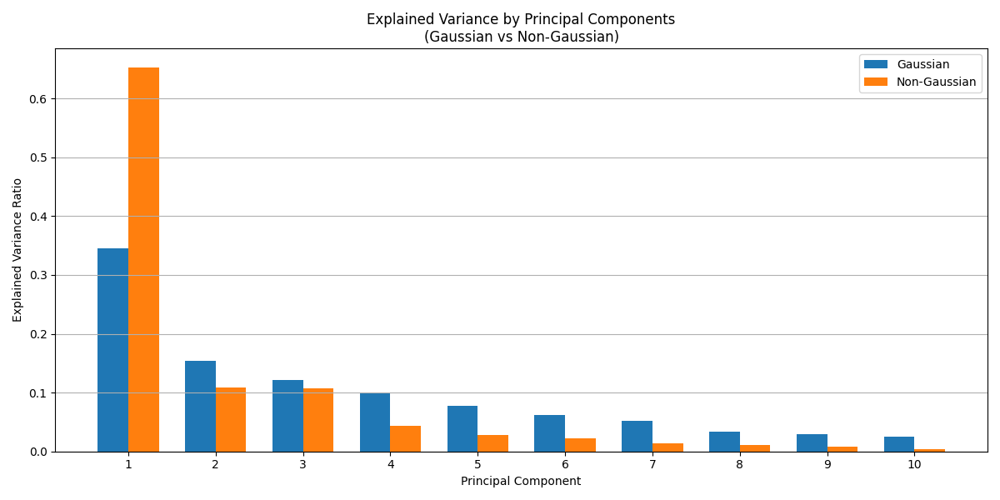

- Interpretation of Results (left: Gaussian, right: Non-Gaussian)
  - During normal market conditions, PC1 accounts for about 25% of the variance, with PC2 and PC3 contributing around 10% each.
  - In contrast, during a financial crisis, PC1 explains approximately 45% of the variance, indicating that overall market movement has a much stronger common influence across individual stocks in such periods.

### 2-3. Naming PCs

After performing PCA or FA, we can extract latent variables. However, interpreting those variables is a task that relies on human judgment—and it's a critical step. This is because, from a modeling perspective, it is important to assess whether those latent variables will remain robust when applied to future data.

  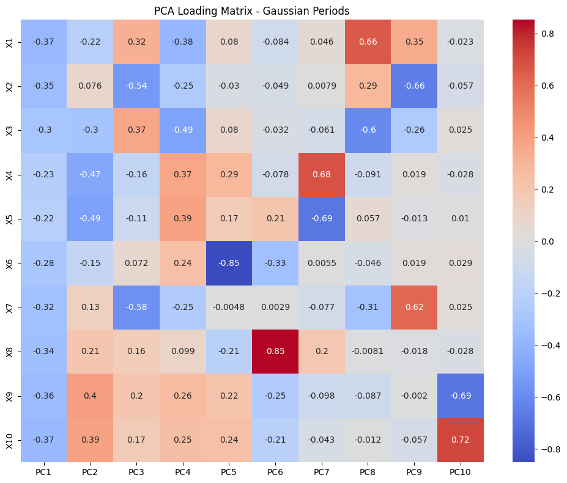

- Interpretation of Results
  - PC1 appears to be influenced evenly by all large-cap stocks, which suggests it can be interpreted as a market factor.
  - PC2 shows paired influence from (X4, X5) and (X9, X10), which may represent an Industry A factor.
  - PC3 is influenced by (X2, X7) and (X1, X3), and can be interpreted as an Industry B factor.
  - Following this logic, we could continue naming PC4, PC5, and so on. If we knew the actual identities of V2 through V11, we could have assigned more meaningful labels—such as finance, IT, etc.—instead of generic labels like Industry A and B.

  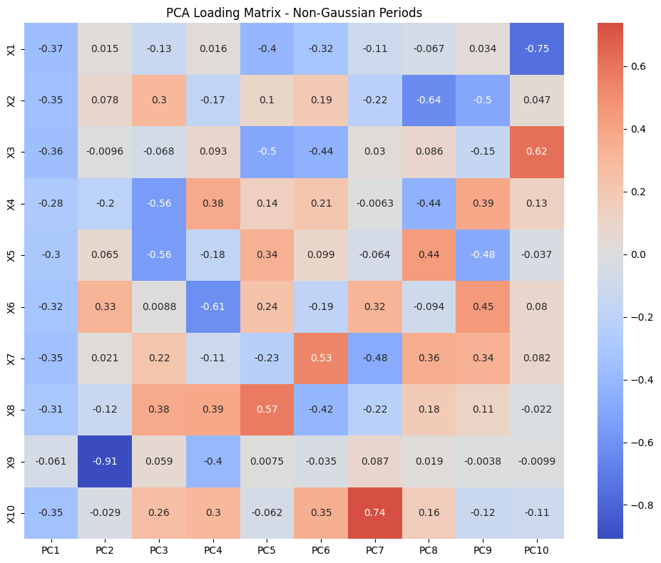

- Interpretation of Results
  - PC1 appears to be influenced broadly by most large-cap stocks, suggesting it represents a market factor. However, since X9 shows little to no loading on PC1, it may be a stock that remains relatively unaffected by overall market conditions.
  - PC2 is primarily driven by X9 alone, indicating that it may represent a stock-specific factor for X9.
  - PC3 shows a paired influence from X4 and X5, which can be interpreted as an Industry C factor.

### 2-4. Insights from PCA

Through PCA, we explored latent factors such as market, industry, and stock-specific components. We observed that these latent structures change depending on market conditions. Therefore, rather than modeling directly with all 10 large-cap stocks, it may be more effective to extract key factors via PCA and build a model based on them. This approach can reduce the number of variables while maintaining similar performance, potentially resulting in a more robust model. 

Let’s test this hypothesis by comparing model performance.

## 3. Model Performance Comparison

- Model 1: PCR (PC1–PC4)
  - Since stock data is heavily influenced by latent factors, PCR—which uses a smaller number of principal components instead of all individual stocks—appears to be a more robust model with comparable performance.

- Model 2: 2nd-Degree Polynomial Regression + Ridge
  - This model, like PCR, is a type of regression, but incorporates a second-degree polynomial to account for non-Gaussian periods.
Ridge regularization was applied to improve robustness, given that the data tends to be approximately Gaussian in nature.

  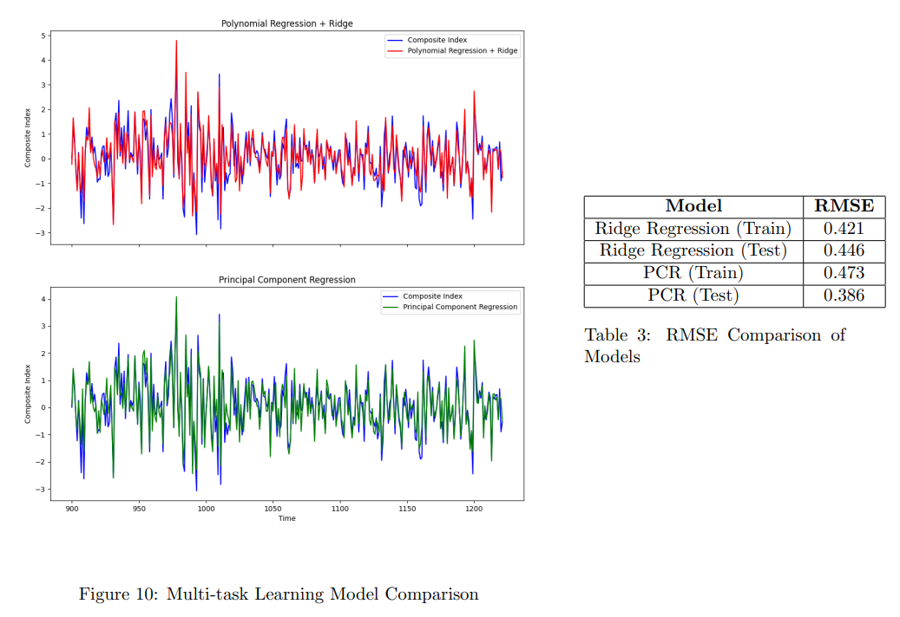

- Interpretation of Results (Top: Polynomial + Ridge, Bottom: PCR)
  - The data was split into a training period (0–900) and a test period (900–1222).
  - The performance evaluation shows that PCR outperformed the polynomial model. This suggests that PCR is a more robust model, capable of making accurate predictions even during periods of high volatility.
